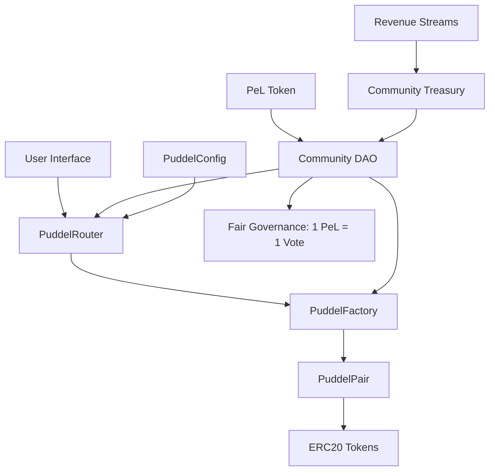

# 🎨 PuddelSwap DEX - The Creative Economy Exchange

[](https://opensource.org/licenses/MIT)
[](https://soliditylang.org/)
[](https://hardhat.org/)
[](./docs/SECURITY_AUDIT.md)

> **The first DEX built specifically for artists, game developers, and creative communities.**

PuddelSwap bridges the gap between DeFi and creative industries. We provide accessible cryptocurrency tools for artists and developers through intuitive interfaces, NFT-powered governance (veNFTs), and sustainable tokenomics designed to support long-term creative projects. Our platform eliminates traditional barriers to entry while maintaining professional-grade functionality.

## 🌟 **Key Differentiators**

### 🎨 **Creative Features (Current & Planned)**

**Available Now:**
- **Portfolio Canvas** - Digital drawing tool for NFT creation
- **NFT Minting** - Create and display digital artwork
- **Fair DEX Trading** - Low fees with 100% to liquidity providers
- **PeL Governance** - Community voting on platform decisions

**Roadmap (2025):**
- **veNFT System** - Visual governance NFTs that evolve with participation (Q2)
- **Game Asset Pools** - Specialized trading for gaming tokens (Q3)
- **Creator Royalties** - Automated royalty distribution system (Q2)
- **Artist Grants** - DAO-managed creative funding (Q3)

### 🏛️ **Governance System**

**Gauge-Only Model** - Streamlined voting focused on value creation:
- **veNFT Locking** - Lock PeL → Mint veNFT → Get voting power (1x-5x multiplier)
- **Weekly Gauge Voting** - Direct emissions to liquidity pools you support
- **Bribe Marketplace** - Protocols pay you to vote for their pools
- **No Complex Proposals** - Team manages parameters with 48-72h time delays
- **Full User Control** - Your funds, your votes, your rewards

**Why Gauge-Only?**
- ✅ Higher participation (30-50% vs 5-15% in traditional DAOs)
- ✅ Faster decisions (48h vs 9+ days)
- ✅ Lower regulatory risk (no DAO legal concerns)
- ✅ Simpler UX (one clear action: vote for pools)
- ✅ Better incentive alignment (vote → earn bribes)

See [Gauge Voting Guide](./docs/governance/GAUGE-VOTING-GUIDE.md) and [ADR](./docs/ADR-GOVERNANCE-SIMPLIFICATION.md) for details.

### 💰 **Creative-Sustainable Economics**
- **100% trading fees to LPs** - Supporting liquidity for creative asset pairs
- **veNFT Staking Rewards** - Lock PeL tokens to mint evolving governance NFTs
- **Creator Revenue Sharing** - Artists earn from their asset pools
- **Game Integration Fees** - Revenue from game partnerships and integrations
- **NFT Marketplace Fees** - Sustainable income from creative asset trading

### 🛡️ **Security-First Development**
- **✅ Static Analysis:** 0 critical vulnerabilities found  
- **✅ Symbolic Execution:** 0 issues detected in core contracts
- **✅ Comprehensive Testing:** High coverage across all functions
- **✅ Hardware Wallet Deployment:** Air-gapped production security
- **⏳ Professional Audit:** Planned before mainnet launch

### ⚡ **Creative Platform Features**
- **Portfolio Canvas** - On-chain generative art creation with DeFi integration
- **NFT Liquidity Pools** - Trade NFT collections with automated market making
- **Game Asset Bridges** - Connect in-game economies to DeFi
- **Artist Launchpad** - Help creators launch tokens and NFT collections
- **Creative Quests** - Seasonal challenges for artists with NFT rewards
- **AI Art Assistant** - Integrated AI tools for creative enhancement (Hugging Face powered)

---

## 🏗️ **Architecture**



### **Smart Contract System**
| Contract | Purpose | Security Features |
|----------|---------|-------------------|
| **PuddelFactory** | Pair creation and fee management | Pausable, access-controlled |
| **PuddelRouter** | User interface for swaps/liquidity | Reentrancy-protected, deadline enforcement |
| **PuddelPair** | Core AMM implementation | Constant-product formula, flash loan resistant |
| **PeL Token** | Governance and veNFT minting | Lock for veNFTs, fee discounts, rewards |
| **veNFT** | Visual governance NFTs | Lock-based voting power, time-weighted decay |
| **Voter** | Gauge voting system | Weekly epochs, proportional emissions |
| **Bribe** | Incentive marketplace | Proportional distribution, multi-token support |
| **Minter** | Emission scheduler | Decay schedule, epoch-based distribution |
| **ProtocolParameters** | Team-managed settings | Bounded values, time-delayed changes |

---

## 🚀 **Quick Start**

### **Prerequisites**
- Node.js 18+ and npm
- Git and modern browser  
- Avalanche-compatible wallet (MetaMask, Core)
- Hardware wallet (recommended for production)

### **Local Development**
```bash
# Clone repository
git clone https://github.com/puddlefarts/puddel-dex-secure-clean.git
cd puddel-dex-secure-clean

# Install dependencies
npm install

# Compile contracts
npx hardhat compile

# Run tests
npx hardhat test

# Start local network
npx hardhat node

# Deploy to local network  
npx hardhat run scripts/deploy-production-secure.js --network localhost
```

### **Frontend Development**
```bash
# Install frontend dependencies
npm install

# Start development server
npm run dev

# Build for production
npm run build
```

---

## 📊 **Network Deployments**

### **Avalanche Fuji Testnet**
*Deployment pending - comprehensive testing in progress*

### **Avalanche Mainnet**
*Planned post-audit deployment with hardware wallet security*

---

## 🔬 **Security & Testing**

### **Security Analysis Results**
- **✅ Slither:** 0 critical, 0 high, 74 informational findings
- **✅ Mythril:** 0 vulnerabilities across all core contracts  
- **✅ Manual Review:** All security patterns verified
- **✅ Test Coverage:** High coverage with edge case testing

### **Security Features**
```solidity
// Example: Built-in reentrancy protection
modifier nonReentrant() {
    require(_status != _ENTERED, "ReentrancyGuard: reentrant call");
    _status = _ENTERED;
    _;
    _status = _NOT_ENTERED;
}

// Example: Comprehensive input validation
function validateTokenPair(address tokenA, address tokenB) internal pure {
    require(tokenA != tokenB, "Identical addresses");
    require(tokenA != address(0) && tokenB != address(0), "Zero address");
}
```

### **Running Security Tests**
```bash
# Static analysis
npm run slither

# Symbolic execution  
npm run mythril

# Comprehensive test suite
npm run test:security

# Gas optimization analysis
npm run test:gas
```

---

## 🏛️ **Governance**

### **Proposal System**
- **Threshold:** 1,000 tokens to create proposals
- **Voting Period:** 7 days
- **Quorum:** 10% participation required
- **Execution:** Immediate upon successful vote

### **Governable Parameters**
| Parameter | Current Value | Purpose |
|-----------|---------------|---------|
| Trading Fee | 0.3% | Standard AMM fee |
| Protocol Fee | 0% | Zero extraction model |
| Max Slippage | 50% | Safety limit |
| Path Length | 10 hops | Multi-hop routing |
| Emergency Mode | Disabled | Circuit breaker |

---

## 📈 **Creative Tokenomics**

### **veNFT System**
- **Lock PeL → Mint veNFT**: Lock PeL tokens to receive visual governance NFTs
- **Evolving Artwork**: veNFTs change appearance based on lock duration and participation
- **Boosted Rewards**: Longer locks = higher voting power and reward multipliers
- **Tradeable Governance**: veNFTs can be traded, creating a governance marketplace

### **Fee Structure**
```
Trading Fee: 0.3% per swap
├── LP Rewards: 85% (supporting liquidity)
├── veNFT Stakers: 10% (rewarding long-term holders)
└── Creator Fund: 5% (supporting artists and developers)

NFT Trading: 2.5% fee
├── Original Creator: 1% (perpetual royalties)
├── LP Rewards: 1% (liquidity incentive)
└── Platform: 0.5% (maintenance and development)
```

### **Creative DEX Comparison**
| Feature | Traditional DEXs | PuddelSwap |
|---------|------------------|------------|
| **Target Users** | DeFi natives | Artists, game devs, creators |
| **Governance** | Token-based | Visual veNFTs with evolving art |
| **Asset Focus** | ERC-20 tokens | Game assets, NFTs, creative tokens |
| **User Experience** | Complex DeFi UI | Intuitive creative interface |
| **Revenue Model** | Trading fees only | Trading + NFTs + game partnerships |
| **Community** | Finance-focused | Creative and gaming communities |
| **Special Features** | Yield farming | Portfolio Canvas, AI art tools |

---

## 🛠️ **Developer Resources**

### **Contract Interfaces**
- [IPuddelFactory](./contracts/interfaces/IPuddelFactory.sol) - Factory interface
- [IPuddelRouter](./contracts/interfaces/IPuddelRouter.sol) - Router interface  
- [IPuddelPair](./contracts/interfaces/IPuddelPair.sol) - Pair interface

### **Integration Guide**
```typescript
// Example: Adding liquidity via contract interaction
const factory = new ethers.Contract(FACTORY_ADDRESS, FACTORY_ABI, signer);
const router = new ethers.Contract(ROUTER_ADDRESS, ROUTER_ABI, signer);

// Add liquidity
await router.addLiquidity(
  tokenA, tokenB, amountA, amountB, 
  amountAMin, amountBMin, to, deadline
);
```

### **Testing Framework**
```bash
# Unit tests
npm run test:unit

# Integration tests  
npm run test:integration

# Security tests
npm run test:security

# Gas benchmarks
npm run test:gas
```

---

## 📚 **Documentation**

### **Core Documentation**
- **[Security Analysis](./docs/SECURITY_AUDIT.md)** - Comprehensive security testing results
- **[Contributing Guidelines](./CONTRIBUTING.md)** - Development standards and processes

### **Creative Economy Docs**  
- **[Artist Onboarding](./docs/ARTIST_GUIDE.md)** - Getting started guide for creators
- **[Game Developer Integration](./docs/GAME_DEV_GUIDE.md)** - Connecting game economies
- **[veNFT System](./docs/tokenomics/veNFT-system.md)** - Visual governance NFT mechanics
- **[Portfolio Canvas](./docs/features/portfolio-canvas.md)** - On-chain art creation tools
- **[Creator Grants](./docs/governance/creator-grants.md)** - Funding for creative projects

---

## 🤝 **Contributing**

We welcome contributions from the community! Please see our [Contributing Guide](./CONTRIBUTING.md) for details.

### **Development Process**
1. Fork the repository
2. Create a feature branch: `git checkout -b feature/amazing-feature`
3. Make changes and add tests
4. Run security checks: `npm run audit`
5. Submit pull request with detailed description

### **Code Standards**
- **Solidity:** Follow OpenZeppelin patterns
- **TypeScript:** Strict typing with comprehensive docs
- **Testing:** Minimum 95% coverage required
- **Security:** All changes must pass audit tools

---

## 🔒 **Security**

### **Responsible Disclosure**
Found a security issue? Please contact us privately:
- **Email:** security@puddelswap.com
- **Encrypted:** PGP key available on request

### **Security Best Practices**
- **Hardware Wallets:** Use for all mainnet interactions
- **Verify Contracts:** Always check addresses match official deployments  
- **Start Small:** Test with small amounts first
- **Stay Updated:** Monitor official channels for security announcements

---

## 🌐 **Community & Support**

- **GitHub Discussions:** Feature requests and technical discussions
- **Issues:** Bug reports and technical support
- **Security:** security@puddelswap.com (private disclosure)

---

## ⚖️ **License**

This project is licensed under the [MIT License](./LICENSE) - see the file for details.

---

## ⚠️ **Disclaimer**

This software is experimental and under active development. Users should:

- **Understand the risks** of DeFi protocols and smart contracts
- **Start with testnet** before using real assets  
- **Use hardware wallets** for significant amounts
- **Do your own research** before making investment decisions

**Security Status:** Comprehensive security analysis completed. Professional audit planned before mainnet.

---

<div align="center">

**Built for Artists 🎨 | Game Developers 🎮 | Digital Creators 💻**

*PuddelSwap: Professional DeFi infrastructure for the creative economy*

</div># Build trigger: Wed Aug 27 02:35:20 EDT 2025
